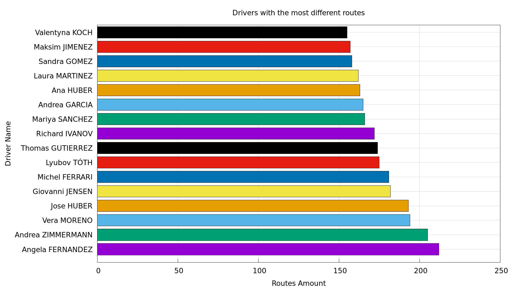
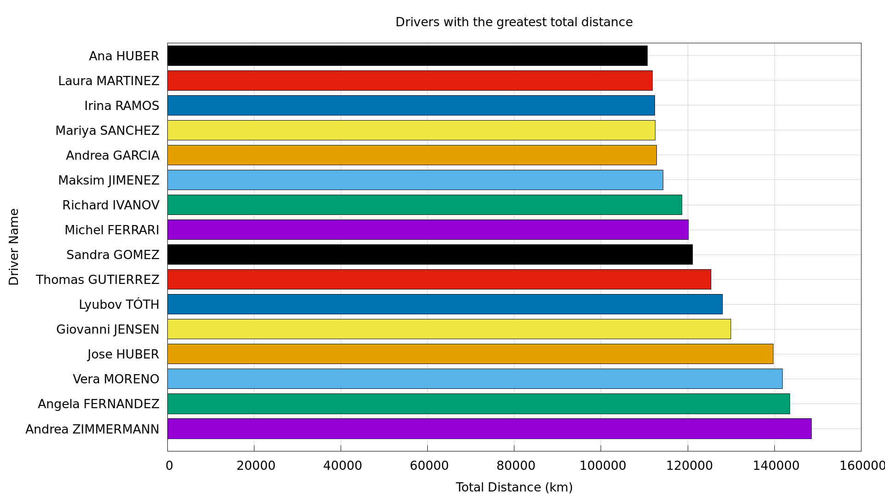
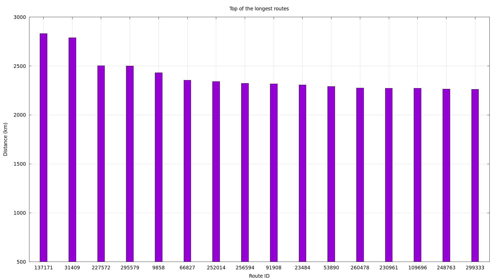
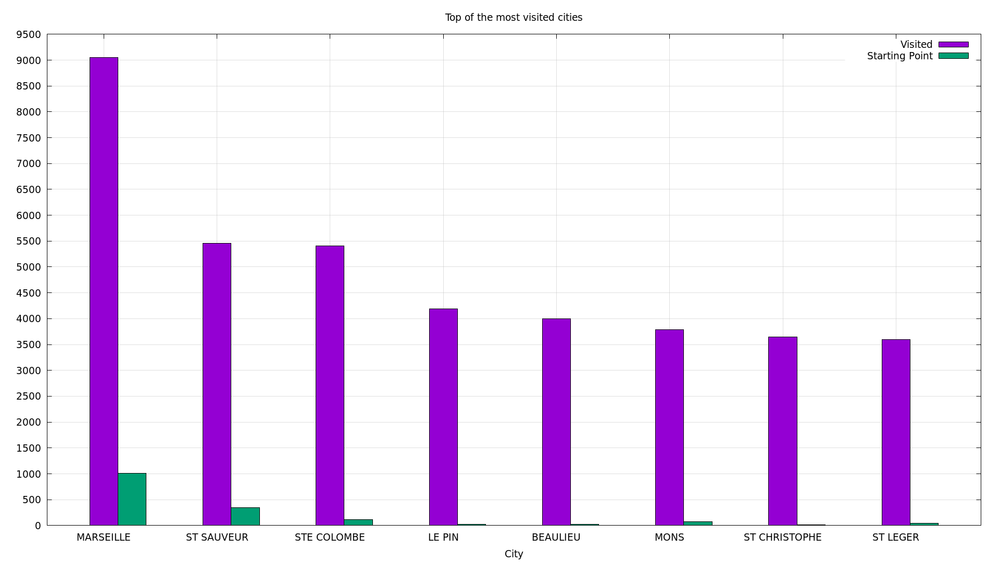
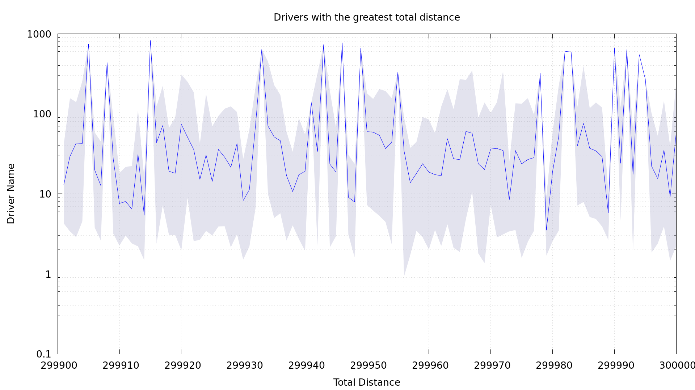

# CY Trucks Project

CY Truck Project analyzes the contents of the of a data file and generate graphs that summarize its contents.

## Requirements

To run properly this project you should have installed [gnuplot](https://gnuplot.sourceforge.net/), [make](https://www.gnu.org/software/make/) and [GCC](https://gcc.gnu.org/).

## Usage

Clone this repository.

```bash
  git clone <INSERT REPOSITORY>
```

Run the shell script.

```bash
./trucks.sh -h
```

Here is the usage of the script.

```
Usage: ./trucks.sh [options] [file]
Options:
  -h: show this help message
  -c: force to re-compile the C program
  -d1 [x]: retrieve the list of the first x (default 10) drivers with the more different routes
  -d2 [x]: retrieves the list of the first x (default 10) drivers to cover the greatest distance
  -l [x]: retrieves list of x (default 10) longest routes
  -t [x]: retrieves the list of x (default 10) most-visited cities.
  -s [start] [end]: retrieves the list of the routes where their IDs are between the start and end and resume their length, minimum and maximum step distance
```
## Features

- Light/dark mode toggle
- Live previews
- Fullscreen mode
- Cross platform

## Limitations

- Graphs may be not readable if the number of data is too high.
- If the options `-s` and `-t` are used together, the script with run twice the C program.

## Demo

Create a graph of the 16 drivers with the more different routes.

```bash
./trucks.sh -d1 16
```



Create a graph of the 16 drivers with the more kilometers.

```bash
./trucks.sh -d2 16
```



Create a graph of the 16 longest routes.

```bash
./trucks.sh -l 16
```



Create a graph of the 8 most visited cities.

```bash
./trucks.sh -t 8
```



Create a graph of the routes lengths with ID between 100 and 200.

```bash
./trucks.sh -s 100 200
```

